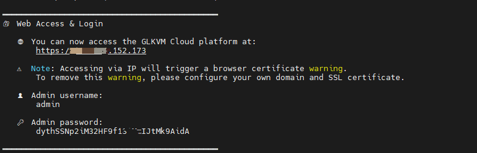
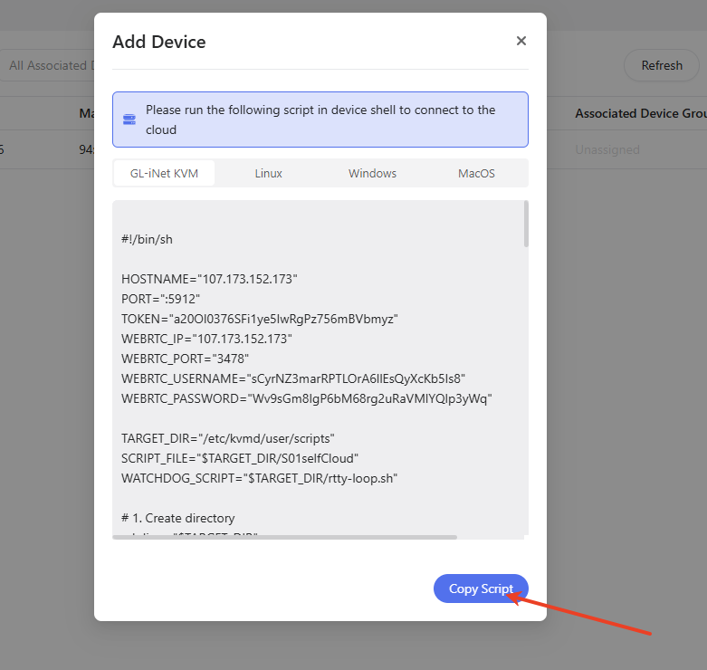
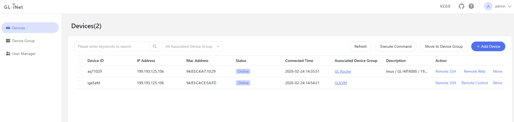
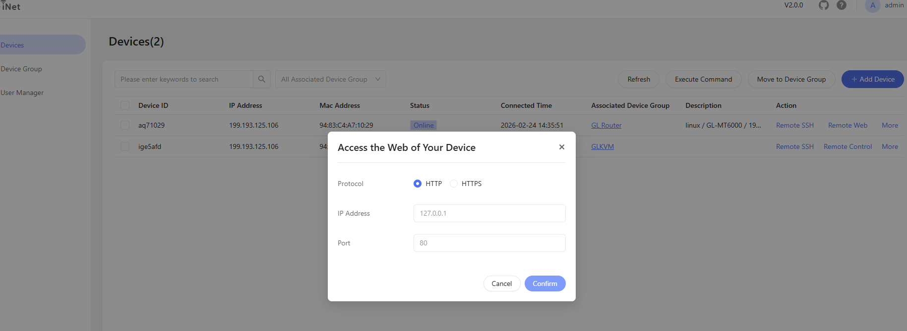

# 自部署轻量云 KVM 远程管理平台

[English Documentation](./README.md) | 中文

自部署轻量云（GLKVM Cloud）是一款面向个人和小微企业的轻量级 KVM 远程云平台。
本项目基于 [rttys](https://github.com/zhaojh329/rttys) 开发，专为需要**快速**构建远程访问平台并注重**数据安全**的用户而设计。

#### 主要功能与特性

*  **用户组和设备支持** - 支持用户组管理特定的设备组设备，实现不同用户管理不同设备
*  **脚本部署** - 通过脚本快速添加设备
*  **远程 SSH** - Web SSH 远程连接
*  **远程控制** - Web远程桌面控制
*  **批量操作** - 支持批量执行命令
*  **快速部署** - 简单命令即可完成自部署
*  **数据安全** - 私有化部署，数据完全可控
*  **独享带宽** - 自部署环境下可享受专属带宽 
*  **轻量设计** - 专为小型企业和个人优化
*  **企业级认证** -  同时支持 **LDAP** 和 **OIDC** 登录方式，适用于企业用户。 

-  **部署与平台兼容性** - 同时支持 **内网部署** 和 **公网部署**，并兼容 **x86_64** 与 **arm64** 平台
-  **HTTP/HTTPS Web 代理支持** - 支持 OpenWrt、树莓派等嵌入式设备及 Linux 主机接入自部署 GLKVM Cloud，实现统一管理与内网穿透访问

## 自部署指南

以下主流操作系统已通过测试验证：

#### Debian 系列

* Ubuntu 18.04 / 20.04 / 22.04 / 24.04
* Debian 11 / 12

#### Red Hat 系列

* AlmaLinux 8 / 9
* Rocky Linux 8 / 9
* CentOS Stream 9

#### 系统要求

| 组件         | 最低配置要求 |
| :------------: | :------------: |
| CPU          | 1 核及以上   |
| 内存         | ≥ 1 GB       |
| 存储         | ≥ 40 GB      |
| 网络带宽         | ≥ 3 Mbps      |
| KVM 固件版本 | ≥ v1.5.0     |

#### 云安全组端口要求

如果你的服务器提供商（如 AWS、阿里云等）启用了 **云安全组**，请确保以下端口已开放：

| 端口    | 协议      | 用途                 |
| ----- | ------- | ------------------ |
| 443   | TCP     | 平台 Web UI 访问       |
| 10443 | TCP     | WebSocket 代理       |
| 5912  | TCP     | 设备连接               |
| 3478  | TCP/UDP | WebRTC TURN 中继服务支持 |

⚠️ **重要提示**：
这些端口将被 **GLKVM 轻量云** 占用，请确保服务器上没有其他程序占用这些端口，否则平台可能无法正常启动。

## 安装

我们提供 **两种** 安装 GLKVM Cloud 的方式：

#### A) 一键安装脚本（推荐，仅支持 x86_64 / amd64）

> **注意：** 一键安装脚本基于 **Docker**。它会自动完成 Docker / Docker Compose 的安装、拉取镜像、根据模板渲染配置文件，并启动所有服务。
>
> **平台支持：** 当前仅支持 **x86_64（amd64）** 平台。

使用 **root 权限** 运行以下命令安装 GLKVM 轻量云：

```bash
( command -v curl >/dev/null 2>&1 && curl -fsSL https://kvm-cloud.gl-inet.com/selfhost/install.sh || wget -qO- https://kvm-cloud.gl-inet.com/selfhost/install.sh ) | sudo bash
```

#### B) 使用 Docker 手动安装

> 完整参考文档请查看：[`docker-compose/README-CN.md`](https://github.com/gl-inet/glkvm-cloud/blob/main/docker-compose/README-CN.md)
>
> 平台支持： 同时支持 x86_64（amd64） 与 arm64（AArch64） 平台。


### 平台访问

安装完成后，安装脚本会在控制台输出平台访问地址和管理员登录信息。你可以通过以下方式访问平台：

```
https://<你的服务器公网IP>
```

⚠️ **提示**：通过 IP 访问时，浏览器会提示 **证书不受信任**。
如需消除该提示，建议配置 **自定义域名 + 有效 SSL 证书**。

### Web UI 登录信息

安装脚本运行结束后，安装控制台会显示 Web UI 管理员用户名和密码（示例）：

```text
👤 管理员用户名：admin
🔑 管理员密码：<自动生成密码>
```



## 功能演示

#### 添加 KVM 设备到轻量云

* 复制脚本



* 在设备终端运行脚本


* 设备成功连接到云平台



#### 远程 SSH


#### 远程桌面控制


#### Web代理功能



## 使用自有 SSL 证书（可选）

⚠️ **可选配置**：
如果你只是想 **快速体验 GLKVM 轻量云**，并且不介意浏览器的证书警告，
可以**跳过**自定义域名和 SSL 证书配置，直接使用服务器 **公网 IP + HTTPS** 访问平台。

但在 **生产环境**，或需要通过 **子域名同时访问多台 KVM 设备** 的情况下，
强烈建议配置 **通配符 SSL 证书**（见下文）。

#### 添加 DNS 记录

如果需要完整的域名访问，请在域名解析中添加以下记录：

```
┌────────────┬──────┬────────────────────┬─────────────────────────────┐
│ 主机记录   │ 类型 │ 值                  │ 用途                         │
├────────────┼──────┼────────────────────┼─────────────────────────────┤
│ www        │  A   │ 你的服务器公网 IP   │ 平台 Web 访问                 │
│ *          │  A   │ 你的服务器公网 IP   │ 多台 KVM 设备远程访问         │
└────────────┴──────┴────────────────────┴─────────────────────────────┘
```

---

#### 使用自定义 SSL 证书

如果要消除浏览器证书警告，请使用支持以下域名的 **通配符 SSL 证书**：

* `*.your-domain.com`（设备访问）
* `www.your-domain.com`（平台访问）

将证书替换到以下目录（文件名必须保持不变）：

```
~/glkvm_cloud/certificate
```

* `glkvm.cer`
* `glkvm.key`

#### 配置更改后重启服务

替换证书后，需要重启 GLKVM 轻量云服务以应用更改：

```bash
cd ~/glkvm_cloud
docker-compose down && docker-compose up -d
```

或（Docker CLI 插件版本）：

```bash
docker compose down && docker compose up -d
```

### 域名访问示例

配置完成后，你可以通过以下方式访问平台：

```
https://www.your-domain.com
```
